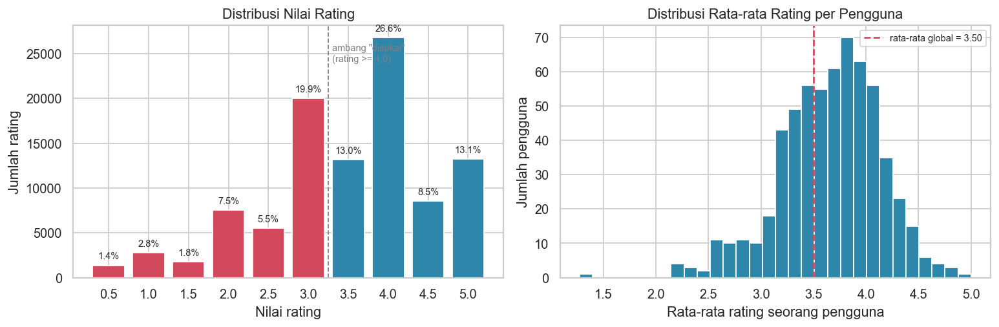
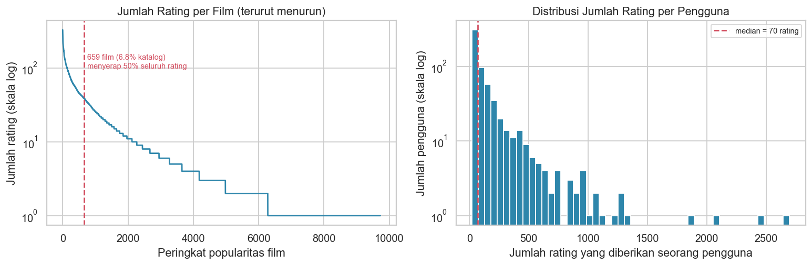
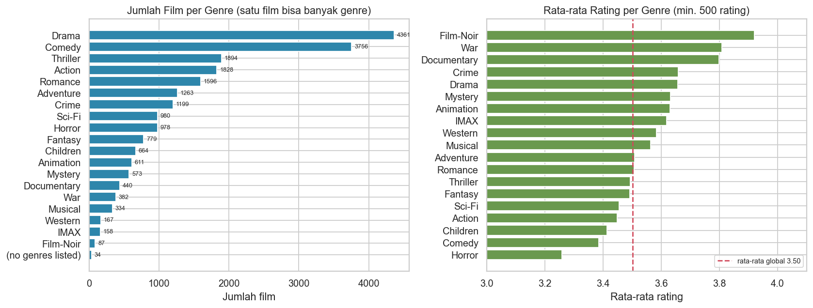
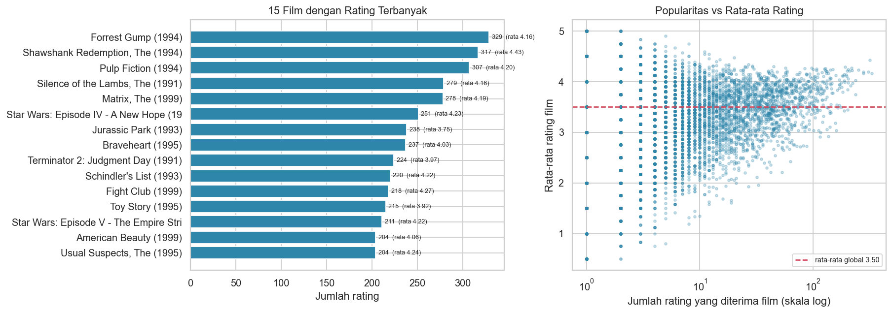
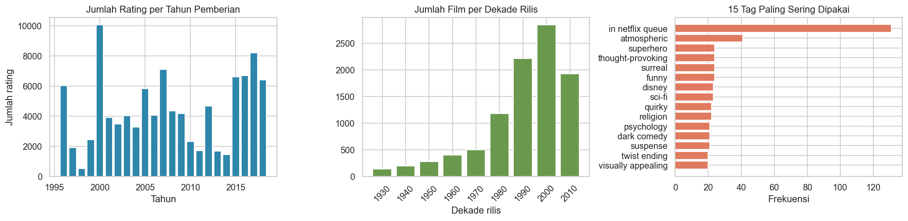
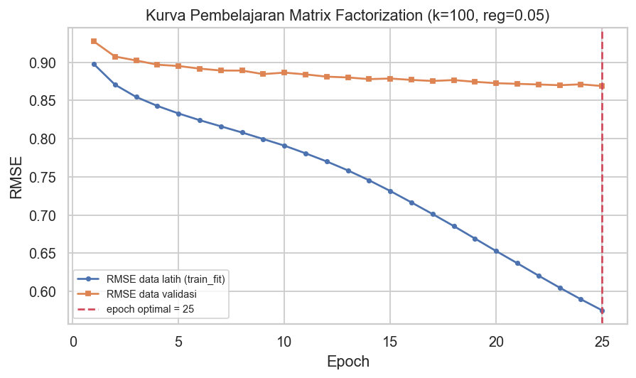
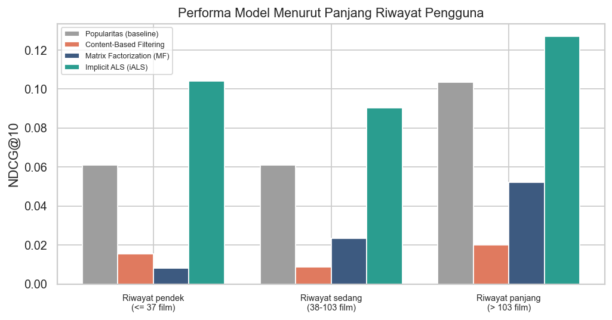

# Laporan Proyek Machine Learning - Andi Arif Abdillah

## Sistem Rekomendasi Film: Perbandingan *Content-Based Filtering* dan *Collaborative Filtering* pada Dataset MovieLens

---

## Project Overview

### Latar Belakang

Katalog layanan hiburan digital hari ini berisi puluhan ribu judul — jauh melampaui kemampuan siapa pun untuk menelusurinya satu per satu. Ironisnya, kelimpahan pilihan justru menyulitkan. Ketika opsi yang tersedia terlalu banyak, orang cenderung menunda keputusan atau tidak memutuskan sama sekali, gejala yang dikenal dalam psikologi konsumen sebagai ***choice overload***. Bagi penyedia layanan, katalog panjang yang tidak dapat dijelajahi bukanlah aset melainkan beban.

Sistem rekomendasi hadir sebagai jawabannya. Perannya bukan memperbesar katalog, melainkan **mempersempitnya secara cerdas** menjadi belasan judul yang benar-benar layak dipertimbangkan seorang pengguna tertentu.

Nilai ekonominya nyata dan terdokumentasi. Gomez-Uribe dan Hunt (2015), dua insinyur Netflix, melaporkan bahwa **lebih dari 80% jam tontonan di Netflix berasal dari rekomendasi**, bukan dari pencarian mandiri pengguna. Mereka juga menaksir nilai gabungan sistem personalisasi dan rekomendasi mereka **melebihi satu miliar dolar per tahun**, terutama melalui penurunan tingkat berhenti berlangganan. Angka tersebut menjelaskan mengapa sistem rekomendasi menjadi salah satu penerapan *machine learning* yang paling bernilai secara komersial.

Analisis data pada proyek ini memperlihatkan persoalannya secara konkret. Dari 9.742 film pada dataset MovieLens:

- hanya **659 film (6,8% katalog)** yang menyerap **separuh** dari seluruh rating;
- **62,5% film menerima kurang dari lima rating**;
- **3.446 film hanya pernah dirating satu kali**.

Tanpa mekanisme rekomendasi, ribuan judul praktis tidak akan pernah ditemukan siapa pun. Inilah persoalan **ekor panjang (*long tail*)** yang menjadi latar utama proyek ini.

### Mengapa Proyek Ini Penting Diselesaikan

**Pertama, waktu pengguna sangat terbatas.** Layar rekomendasi umumnya hanya memuat sekitar sepuluh judul. Setiap slot yang salah bukan sekadar kesalahan statistik, melainkan kesempatan yang hilang — baik bagi pengguna maupun bagi film yang seharusnya ditemukan.

**Kedua, katalog ekor panjang membutuhkan bantuan untuk hidup.** Film populer akan ditemukan pengguna dengan atau tanpa sistem rekomendasi. Nilai tambah sesungguhnya sebuah sistem rekomendasi terletak pada kemampuannya mempertemukan film yang kurang dikenal dengan orang yang tepat. Karena itu proyek ini tidak hanya mengukur ketepatan, tetapi juga **cakupan katalog (*coverage*)**.

**Ketiga, pilihan pendekatan bukan perkara sepele.** *Content-based filtering* dan *collaborative filtering* memiliki kekuatan dan kelemahan yang berbeda secara mendasar. Menentukan mana yang lebih tepat untuk suatu kasus memerlukan bukti kuantitatif dengan protokol evaluasi yang jujur, bukan sekadar asumsi atau kebiasaan.

### Hasil Riset dan Referensi Terkait

Beberapa temuan penelitian menjadi landasan langsung rancangan proyek ini.

**Cremonesi, Koren, dan Turrin (2010)** menunjukkan bahwa **model dengan RMSE terbaik belum tentu menghasilkan rekomendasi top-N terbaik**. Metrik galat seperti RMSE hanya dihitung pada item yang benar-benar dirating pengguna, sehingga tidak pernah menghukum model karena menempatkan item asing di puncak daftar. Temuan inilah yang mendorong proyek ini menyertakan **dua model *collaborative filtering***: satu yang dioptimasi untuk prediksi rating, dan satu lagi yang dioptimasi untuk mutu peringkat. Perbandingan keduanya menjadi salah satu temuan utama laporan ini.

**Koren, Bell, dan Volinsky (2009)**, para pemenang kompetisi *Netflix Prize*, menegaskan bahwa **suku bias** — kecenderungan seorang pengguna menilai murah hati atau pelit, dan kecenderungan sebuah film dinilai tinggi atau rendah — menjelaskan sebagian besar variasi rating, bahkan sebelum interaksi selera personal diperhitungkan. Proyek ini mengadopsi bentuk *biased matrix factorization* dari makalah tersebut, dan hasilnya mengonfirmasi temuan mereka.

**Hu, Koren, dan Volinsky (2008)** memperkenalkan pendekatan *implicit feedback* dengan *alternating least squares*, yang memperlakukan seluruh pasangan pengguna–item sebagai data — termasuk pasangan yang tidak pernah berinteraksi — dengan bobot keyakinan berbeda. Algoritma inilah yang menjadi model dengan performa terbaik pada proyek ini.

**Lops, de Gemmis, dan Semeraro (2011)** mengurai keterbatasan bawaan *content-based filtering*, khususnya ***over-specialization***: sistem yang hanya merekomendasikan hal serupa dengan yang sudah dikonsumsi tidak akan pernah memperkenalkan sesuatu yang baru. Proyek ini berhasil mereproduksi gejala tersebut secara terukur.

**Harper dan Konstan (2015)** mendokumentasikan sejarah dan karakteristik dataset MovieLens yang dipakai di sini, termasuk peringatan bahwa versi kecil dataset ini ditujukan untuk keperluan edukasi dan pengembangan, bukan untuk mengklaim performa produksi.

---

## Business Understanding

### Klarifikasi Masalah

Sebuah layanan pemutaran film memiliki katalog berisi ribuan judul dan basis pengguna yang aktif memberi rating. Data tersebut sudah terkumpul selama bertahun-tahun, tetapi belum dimanfaatkan untuk membantu pengguna menemukan tontonan berikutnya. Akibatnya, pengguna hanya berputar di sekitar judul-judul terkenal, sementara sebagian besar katalog tidak pernah tersentuh.

Terdapat tiga kendala nyata yang harus dihadapi sistem apa pun yang dibangun:

1. **Data sangat renggang.** Hanya 1,7% dari seluruh kemungkinan pasangan pengguna–film yang benar-benar terisi rating.
2. **Sebagian besar film hampir tidak memiliki data.** Lebih dari 62% film menerima kurang dari lima rating, sehingga bukti kolaboratifnya nyaris nol.
3. **Selera bergerak sepanjang waktu.** Data terentang 22 tahun (1996–2018), sehingga evaluasi harus memprediksi ke depan, bukan menambal celah acak di masa lalu.

### Problem Statements

1. **Bagaimana merekomendasikan film yang relevan bagi seorang pengguna tanpa mengharuskannya menjelajahi katalog berisi ribuan judul?** Pengguna hanya punya waktu untuk melihat sekitar sepuluh judul, dan kesepuluhnya harus berpeluang besar untuk benar-benar ditonton.

2. **Bagaimana sistem tetap dapat memberi rekomendasi untuk film yang jarang atau belum pernah dirating, padahal jumlahnya justru mendominasi katalog?** Sistem yang hanya mampu merekomendasikan film populer tidak memberi nilai tambah, karena film populer memang sudah pasti ditemukan pengguna tanpa bantuan.

3. **Pendekatan mana yang lebih tepat untuk kasus ini, dan dengan bukti apa keunggulannya dapat dipertanggungjawabkan?** Dibutuhkan pembanding yang sah, protokol evaluasi yang jujur, dan metrik yang sesuai dengan apa yang benar-benar dilihat pengguna di layar.

### Goals

1. **Menghasilkan top-10 rekomendasi film yang dipersonalisasi** bagi setiap pengguna, dan menampilkannya sebagai keluaran nyata sistem.

2. **Membangun sistem yang mampu menjangkau film di ekor katalog**, diukur melalui metrik cakupan katalog (Coverage@10). Sistem yang hanya mendaur ulang film populer dianggap belum memenuhi tujuan ini.

3. **Membuktikan secara terukur bahwa model yang dipilih mengungguli baseline populer** pada metrik Precision@10, Recall@10, dan NDCG@10, dengan protokol evaluasi yang identik bagi seluruh model dan penyetelan *hyperparameter* yang sepenuhnya terpisah dari data uji.

### Solution Approach

Tiga solusi dibangun dan dibandingkan: dua pendekatan sistem rekomendasi sesuai ketentuan proyek, ditambah satu *baseline* sebagai garis batas kelayakan.

#### Solusi 1 — *Content-Based Filtering*

Genre dan tag setiap film digabungkan menjadi satu dokumen teks (*content soup*), lalu diubah menjadi vektor **TF-IDF**. Kemiripan antarfilm dihitung dengan ***cosine similarity***. Sistem bekerja dalam dua mode:

- **Mode item-ke-item** — diberikan satu film, sistem menampilkan sepuluh film yang kontennya paling mirip. Inilah mekanisme di balik kolom "karena Anda menonton …".
- **Mode personal** — profil pengguna dibentuk sebagai rata-rata berbobot vektor konten seluruh film yang ia sukai, lalu film kandidat diperingkat berdasarkan kedekatannya dengan profil tersebut.

Pendekatan ini dipilih karena **tidak bergantung sama sekali pada data pengguna lain**, sehingga secara teoretis kebal terhadap masalah *cold-start item* — persoalan yang justru mendominasi katalog ini.

#### Solusi 2 — *Collaborative Filtering*

Pola interaksi antarpengguna dipelajari melalui faktorisasi matriks, dalam dua varian yang sengaja dibedakan tujuan optimasinya:

- **Matrix Factorization berbias (SGD)** — dilatih pada rating eksplisit 0,5–5,0 untuk **memprediksi nilai rating**, mengikuti formulasi Koren et al. (2009). Dievaluasi dengan RMSE dan MAE.
- **Implicit ALS** — dilatih pada sinyal biner "disukai" (rating ≥ 4) untuk **menyusun peringkat**, mengikuti Hu et al. (2008). Dievaluasi dengan metrik peringkat.

Kedua varian disertakan justru untuk menguji temuan Cremonesi et al. (2010): apakah model dengan galat prediksi terkecil benar-benar menghasilkan rekomendasi terbaik.

#### Pembanding — *Baseline* Popularitas

Merekomendasikan film yang paling banyak dirating, sama untuk semua orang. Tanpa pembanding ini, mustahil membuktikan bahwa sebuah model benar-benar mempelajari selera dan bukan sekadar mengikuti arus.

---

## Data Understanding

### Sumber Data

Dataset yang digunakan adalah **MovieLens *ml-latest-small*** yang dirilis oleh [GroupLens Research](https://grouplens.org/datasets/movielens/latest/), laboratorium riset di University of Minnesota.

> **Tautan unduh:** <https://files.grouplens.org/datasets/movielens/ml-latest-small.zip>
> **Halaman resmi:** <https://grouplens.org/datasets/movielens/latest/>

Notebook proyek ini mengunduh berkas tersebut secara otomatis sehingga seluruh alur dapat direproduksi tanpa persiapan manual.

### Jumlah dan Kondisi Data

Dataset terdiri atas empat berkas CSV yang saling terhubung melalui kunci `movieId` dan `userId`.

| Berkas | Jumlah baris | Jumlah kolom | Isi |
|---|---|---|---|
| `ratings.csv` | 100.836 | 4 | Rating pengguna terhadap film |
| `movies.csv` | 9.742 | 3 | Metadata film (judul dan genre) |
| `tags.csv` | 3.683 | 4 | Tag bebas buatan pengguna |
| `links.csv` | 9.742 | 3 | Pranala ke IMDb dan TMDB |

**Ringkasan skala masalah:**

| Aspek | Nilai |
|---|---|
| Jumlah pengguna unik | 610 |
| Jumlah film pada katalog | 9.742 |
| Jumlah film yang pernah dirating | 9.724 |
| Jumlah film tanpa satu pun rating | 18 |
| Jumlah rating | 100.836 |
| Rentang nilai rating | 0,5 – 5,0 (kelipatan 0,5) |
| Rata-rata rating global | 3,502 |
| Rentang waktu pengamatan | 29 Maret 1996 – 24 September 2018 |
| Kepadatan matriks interaksi | 1,70% |
| **Tingkat kerenggangan (*sparsity*)** | **98,30%** |

**Kondisi data hasil pemeriksaan:**

1. **Tidak ada nilai kosong** pada `ratings`, `movies`, maupun `tags`. Delapan nilai kosong hanya terdapat pada kolom `tmdbId` di `links.csv`, berkas yang tidak dipakai proyek ini.
2. **Tidak ada baris duplikat** dan **tidak ada pasangan `(userId, movieId)` ganda**, sehingga asumsi "satu pengguna memberi satu rating per film" benar-benar berlaku.
3. **Seluruh nilai rating berada pada rentang yang sah** dan setiap `movieId` pada `ratings` selalu ditemukan pada `movies` — tidak ada relasi menggantung.
4. **Terdapat 18 film yang belum pernah dirating** dan **34 film tanpa keterangan genre** (`(no genres listed)`) — dua kasus yang memerlukan penanganan khusus pada tahap persiapan data.
5. **Matriks interaksi sangat renggang**, hanya 1,70% sel terisi. Inilah tantangan utama proyek.

### Uraian Seluruh Variabel

**`ratings.csv` — data interaksi utama (100.836 baris)**

| Variabel | Tipe | Keterangan |
|---|---|---|
| `userId` | int64 | Identitas anonim pengguna. Setiap pengguna dijamin memiliki minimal 20 rating. |
| `movieId` | int64 | Identitas film; kunci penghubung ke `movies.csv`, `tags.csv`, dan `links.csv`. |
| `rating` | float64 | Penilaian eksplisit pengguna pada skala 0,5–5,0 dengan kelipatan 0,5 (10 tingkat). |
| `timestamp` | int64 | Waktu pemberian rating dalam detik sejak 1 Januari 1970 (UTC). Dipakai untuk pemisahan data secara temporal. |

**`movies.csv` — metadata konten (9.742 baris)**

| Variabel | Tipe | Keterangan |
|---|---|---|
| `movieId` | int64 | Identitas film. |
| `title` | object | Judul film beserta tahun rilis dalam tanda kurung, contoh `Toy Story (1995)`. |
| `genres` | object | Daftar genre yang dipisahkan tanda pipa, contoh `Adventure\|Animation\|Children`. Terdapat **19 kategori genre** serta nilai khusus `(no genres listed)`. Rata-rata satu film memiliki 2,27 genre. |

**`tags.csv` — metadata konten dari pengguna (3.683 baris)**

| Variabel | Tipe | Keterangan |
|---|---|---|
| `userId` | int64 | Pengguna yang memberi tag. Hanya 58 dari 610 pengguna yang pernah memberi tag. |
| `movieId` | int64 | Film yang diberi tag. Mencakup 1.572 film (16,1% katalog). |
| `tag` | object | Kata atau frasa bebas buatan pengguna, contoh `pixar`, `dark comedy`, `based on a book`. Terdapat 1.589 tag unik. |
| `timestamp` | int64 | Waktu pemberian tag. |

**`links.csv` — pranala eksternal (9.742 baris)**

| Variabel | Tipe | Keterangan |
|---|---|---|
| `movieId` | int64 | Identitas film pada MovieLens. |
| `imdbId` | int64 | Identitas film yang bersesuaian pada IMDb. |
| `tmdbId` | float64 | Identitas film yang bersesuaian pada TMDB; terdapat 8 nilai kosong. |

Berkas `links.csv` hanya berguna untuk pengayaan data dari sumber eksternal (poster, sinopsis) sehingga **tidak dipakai** pada proyek ini.
### Exploratory Data Analysis

#### 1. Distribusi Nilai Rating



**Insight.** Nilai 4,0 adalah rating yang paling sering diberikan, dan sekitar **48% rating bernilai ≥ 4,0**. Distribusi yang miring ke kanan ini wajar pada data rekomendasi karena pengguna cenderung hanya menonton film yang memang mereka minati. Konsekuensinya, **rating 3,0 bukan berarti "netral"** melainkan relatif rendah — dasar yang dipakai untuk menetapkan ambang "disukai" pada nilai 4,0.

Panel kanan memperlihatkan hal yang lebih penting: rata-rata rating antarpengguna tersebar luas dari sekitar 1,3 sampai 5,0 dengan simpangan baku 0,45. Ada pengguna yang murah hati dan ada yang pelit memberi nilai. Perbedaan sistematis ini kemudian ditangani secara eksplisit oleh **suku bias pengguna** ($b_u$) pada model *Matrix Factorization*, sehingga model tidak salah menafsirkan rating 3,5 dari pengguna pelit sebagai sinyal negatif.

#### 2. Pola Ekor Panjang (*Long Tail*)



**Insight.** Data sangat timpang di kedua sisi. Hanya **659 film (6,8% katalog) menyerap separuh seluruh rating**, sementara **62,5% film memiliki kurang dari 5 rating** dan 3.446 film hanya dirating satu kali. Pola ini punya dua akibat langsung pada rancangan proyek:

1. *Collaborative filtering* tidak memiliki sinyal memadai untuk film di ekor distribusi. Karena itu evaluasi peringkat menggunakan *candidate pool* berisi film dengan minimal 5 rating.
2. Model yang sekadar merekomendasikan film terpopuler dapat terlihat "cukup baik" secara angka. Karena itu **baseline popularitas wajib disertakan** sebagai pembanding.

Di sisi pengguna, distribusi juga miring: median hanya sekitar 70 rating, sedangkan pengguna paling aktif memberi 2.698 rating.

#### 3. Genre: Sebaran Katalog dan Kualitas Persepsi



**Insight.** `Drama` (4.361 film) dan `Comedy` (3.756 film) mendominasi katalog. Perbedaan rata-rata rating antargenre juga nyata: `Film-Noir` (3,92), `War` (3,81), dan `Documentary` (3,80) konsisten dinilai lebih tinggi, sedangkan `Horror` (3,26) dan `Comedy` (3,39) berada di bawah rata-rata global 3,50.

Namun ada catatan penting: hanya ada **19 kategori genre untuk 9.742 film**. Artinya ribuan film berbagi kombinasi genre yang **persis sama** — ratusan film sekaligus berlabel `Comedy|Drama|Romance`. Keterbatasan resolusi inilah yang mendorong proyek ini memperkaya representasi konten dengan tag buatan pengguna, sekaligus menjadi alasan teoretis mengapa *content-based filtering* diperkirakan kalah presisi — dugaan yang kemudian terbukti pada tahap evaluasi.

#### 4. Popularitas versus Kualitas



**Insight.** Diagram sebar memperlihatkan bentuk corong yang khas: film dengan sedikit rating menyebar dari 0,5 sampai 5,0, sementara film dengan ratusan rating memusat pada kisaran 3,5–4,3. Terdapat **289 film beroleh rata-rata sempurna 5,0 hanya karena dinilai satu orang**.

Karena itu peringkat berbasis rata-rata rating mentah akan dipenuhi film antah-berantah. Model *Matrix Factorization* menangani hal ini melalui **regularisasi pada suku bias item** ($b_i$) yang menarik estimasi film berdata sedikit mendekati rata-rata global — sebuah bentuk *shrinkage*. Korelasi yang lemah antara log-popularitas dan rata-rata rating (r = 0,112) juga menegaskan bahwa popularitas dan kualitas bukan hal yang sama.

#### 5. Dimensi Waktu dan Tag Pengguna



**Insight.** Rating terkumpul selama 22 tahun (1996–2018). Selera penonton dan komposisi katalog jelas berubah sepanjang periode itu. Karena itu proyek ini **tidak memakai pembagian data acak**, melainkan **pembagian temporal per pengguna**: model dilatih dengan riwayat awal setiap pengguna dan diuji pada tontonan mereka berikutnya — meniru kondisi produksi yang sesungguhnya.

Tag hanya mencakup 16,1% katalog dan berasal dari 58 pengguna saja, tetapi isinya jauh lebih spesifik daripada genre (`pixar`, `in netflix queue`, `atmospheric`, `based on a book`). Tag karena itu dipakai sebagai **pelengkap**, bukan pengganti genre, sehingga film tanpa tag tetap memperoleh representasi konten yang sah.

---

## Data Preparation

Delapan tahap berikut dijalankan **berurutan** — urutan yang sama persis dengan notebook. Keluaran satu tahap menjadi masukan tahap berikutnya.

### Tahap 1 — Verifikasi Duplikat, Nilai Kosong, dan Pemilihan Berkas

**Proses.** Pasangan `(userId, movieId)` ganda dibuang dengan mempertahankan rating terakhir, baris dengan nilai kosong pada kolom kunci dihapus, dan `movieId` ganda pada katalog dibersihkan. Berkas `links.csv` dikeluarkan dari alur.

```python
ratings = ratings.drop_duplicates(subset=['userId', 'movieId'], keep='last').reset_index(drop=True)
ratings = ratings.dropna(subset=['userId', 'movieId', 'rating'])
movies = movies.drop_duplicates(subset=['movieId']).reset_index(drop=True)
```

**Mengapa diperlukan.** Seluruh model mengasumsikan setiap sel matriks interaksi berisi paling banyak satu rating. Bila terdapat pasangan ganda, satu interaksi akan terhitung dua kali dan bobot pembelajaran menjadi timpang. Pemeriksaan menunjukkan data sudah bersih (0 baris dibuang), sehingga tahap ini bersifat **defensif**: bila suatu saat dataset diperbarui dan mengandung duplikat, masalahnya langsung tertangani.

### Tahap 2 — Ekstraksi Tahun Rilis dan Pembersihan Judul

**Proses.** Tahun rilis diekstrak dari kolom `title` menggunakan ekspresi reguler, lalu dipisahkan menjadi kolom tersendiri.

```python
movies['tahun_rilis'] = pd.to_numeric(
    movies.title.str.extract(r'\((\d{4})\)\s*$')[0], errors='coerce')
movies['judul_bersih'] = movies.title.str.replace(r'\s*\(\d{4}\)\s*$', '', regex=True).str.strip()
```

**Mengapa diperlukan.** Kolom `title` menggabungkan dua informasi berbeda dalam satu string (`Toy Story (1995)`). Selama masih menyatu, tahun rilis tidak dapat dianalisis sebagai angka dan pencarian judul menjadi rapuh karena pengguna harus menuliskan tahunnya dengan tepat. Hasilnya: hanya **13 film** yang judulnya tidak memuat tahun rilis, sedangkan sisanya terentang dari 1902 sampai 2018. Judul bersih kemudian dipakai sebagai antarmuka fungsi rekomendasi.

### Tahap 3 — Parsing dan Normalisasi Genre

**Proses.** Penanda `(no genres listed)` dihapus, string genre dipecah pada tanda pipa, lalu setiap genre diubah menjadi satu token tunggal huruf kecil tanpa karakter khusus.

```python
def normalkan_token(teks):
    return re.sub(r'[^a-z0-9]+', '', str(teks).lower())

movies['daftar_genre'] = (movies.genres
                          .str.replace('(no genres listed)', '', regex=False)
                          .str.split('|')
                          .apply(lambda g: [x for x in g if x]))
movies['token_genre'] = movies.daftar_genre.apply(lambda g: ' '.join(normalkan_token(x) for x in g))
```

**Mengapa diperlukan.** TF-IDF bekerja pada dokumen teks yang tersusun atas token. Tanpa normalisasi, `Sci-Fi` berisiko terpecah menjadi dua token (`sci` dan `fi`) yang bercampur dengan token lain. Sementara itu `(no genres listed)` sebenarnya bukan genre melainkan penanda ketiadaan informasi; bila dibiarkan, 34 film akan dianggap saling mirip tanpa dasar apa pun. Setelah tahap ini, tepat **34 film memiliki token genre kosong** — kondisi yang jujur dan sesuai kenyataan.

### Tahap 4 — Agregasi dan Normalisasi Tag per Film

**Proses.** Setiap tag dinormalkan menjadi satu token utuh, tag sepanjang satu karakter dibuang, lalu seluruh tag milik satu film digabungkan menjadi satu string.

```python
tags_bersih['token_tag'] = tags_bersih.tag.apply(normalkan_token)
tags_bersih = tags_bersih[tags_bersih.token_tag.str.len() > 1]
tag_per_film = tags_bersih.groupby('movieId').token_tag.apply(lambda s: ' '.join(s))
```

**Mengapa diperlukan.** Pada `tags.csv` satu film muncul di banyak baris karena diberi tag oleh beberapa pengguna, sedangkan TF-IDF membutuhkan tepat **satu dokumen per film**. Frasa seperti `based on a book` sengaja dinormalkan menjadi satu token utuh (`basedonabook`) agar frasa tetap bermakna sebagai satu konsep dan tidak pecah menjadi kata umum `based`, `on`, `a`, `book` yang akan menghubungkan film-film yang sebenarnya tidak berkaitan.

Frekuensi tag sengaja dipertahankan: bila lima pengguna menandai sebuah film dengan `pixar`, token tersebut muncul lima kali sehingga TF-IDF memberinya bobot lebih besar — mekanisme *term frequency* yang bekerja persis seperti pada teks biasa. Hasilnya, seluruh 3.683 baris tag lolos penyaringan (tidak ada tag sepanjang satu karakter) dan **1.572 film (16,1% katalog)** memperoleh representasi tag.

### Tahap 5 — Pembentukan *Content Soup* dan Vektorisasi TF-IDF

**Proses.** Token genre digandakan dua kali lalu digabung dengan token tag, kemudian seluruh dokumen diubah menjadi matriks TF-IDF dan dinormalisasi L2.

```python
movies['content_soup'] = ((movies.token_genre + ' ') * 2 + movies.token_tag).str.strip()

vectorizer = TfidfVectorizer(token_pattern=r'\S+', min_df=1)
tfidf_semua = vectorizer.fit_transform(movies.content_soup)
tfidf = normalize(vectorizer.transform(meta.content_soup))   # cosine = dot product
```

Contoh keluaran untuk *Toy Story*:

```
adventure animation children comedy fantasy adventure animation children comedy fantasy pixar pixar fun
```

**Mengapa diperlukan.** Kemiripan antarfilm hanya dapat dihitung apabila setiap film sudah berbentuk vektor numerik. Dua keputusan penting diambil di sini:

1. **Token genre digandakan dua kali.** Genre tersedia untuk hampir seluruh katalog, sedangkan tag hanya untuk 16% film. Tanpa penggandaan, film yang memiliki puluhan tag akan didominasi tag sehingga sinyal genrenya tenggelam dan kemiripannya dengan film tanpa tag menjadi tidak sebanding.
2. **Pembobotan TF-IDF, bukan sekadar hitungan.** Bobot IDF menekan token yang muncul di mana-mana (`drama` ada pada 4.361 film sehingga hampir tidak membedakan apa pun) dan mengangkat token langka yang justru khas. Terbukti pada *Toy Story*, bobot tertinggi jatuh pada `pixar` (0,714), jauh di atas `animation` (0,314).

**Normalisasi L2** membuat perkalian titik dua vektor **setara dengan *cosine similarity***, sehingga seluruh kemiripan dapat dihitung lewat satu perkalian matriks yang efisien. Hasil akhir: matriks **9.742 × 1.461 token** dengan kepadatan 0,179%.

### Tahap 6 — *Encoding* `userId` dan `movieId` Menjadi Indeks Kontinu

**Proses.** Setiap id dipetakan ke indeks berurutan 0..n−1, lengkap dengan pemetaan baliknya.

```python
id_pengguna = np.sort(ratings.userId.unique())
pengguna_ke_idx = {uid: i for i, uid in enumerate(id_pengguna)}
katalog = np.sort(train_penuh.movieId.unique())
film_ke_idx = {mid: i for i, mid in enumerate(katalog)}
```

**Mengapa diperlukan.** `userId` berkisar 1–610, tetapi `movieId` melompat-lompat hingga **193.609**. Bila dipakai langsung sebagai indeks matriks, akan terbentuk matriks 610 × 193.610 yang 95% kolomnya kosong — pemborosan memori dan komputasi tanpa manfaat. Katalog model juga sengaja dibatasi pada film yang **pernah muncul di data latih** (8.246 film), karena film di luar itu tidak mungkin dipelajari *collaborative filtering* dan hanya akan menghasilkan vektor laten acak yang menyesatkan.

### Tahap 7 — Pembagian Data Secara Temporal per Pengguna

**Proses.** Rating setiap pengguna diurutkan berdasarkan `timestamp`, lalu 80% pertama menjadi data latih dan 20% terakhir menjadi data uji. Data latih dibagi lagi dengan cara yang sama menjadi `train_fit` dan `validasi`.

```python
def bagi_temporal(df, porsi_latih=0.8):
    df = df.sort_values(['userId', 'timestamp'])
    urutan = df.groupby('userId').cumcount()
    banyak = df.groupby('userId').movieId.transform('size')
    batas = np.ceil(banyak * porsi_latih)
    return df[urutan < batas].copy(), df[urutan >= batas].copy()

train_penuh, test = bagi_temporal(ratings, 0.8)
train_fit, validasi = bagi_temporal(train_penuh, 0.8)
```

| Subset | Jumlah rating | Pengguna | Film | Porsi |
|---|---|---|---|---|
| `train_penuh` | 80.896 | 610 | 8.246 | 80,2% |
| `test` | 19.940 | 610 | 6.243 | 19,8% |
| ├─ `train_fit` | 64.960 | 610 | 7.165 | 64,4% |
| └─ `validasi` | 15.936 | 610 | 5.126 | 15,8% |

**Mengapa diperlukan.** Pembagian acak akan membuat model belajar dari rating yang diberikan pengguna **pada tahun 2018** untuk memprediksi rating yang ia berikan **pada tahun 2000**. Kebocoran waktu semacam itu melambungkan skor evaluasi tetapi tidak pernah terjadi di dunia nyata. Pembagian dilakukan **per pengguna** dan bukan pada satu titik waktu global, supaya setiap pengguna tetap terwakili di kedua sisi. Verifikasi menunjukkan **0 pengguna melanggar urutan waktu**.

Pemisahan `validasi` sama pentingnya: **seluruh penyetelan *hyperparameter* hanya memakai `validasi`**, dan data uji tidak disentuh sampai model final terbentuk. Tanpa pemisahan ini, memilih *hyperparameter* berdasarkan skor uji sama saja dengan melatih model pada data uji.

### Tahap 8 — Matriks Interaksi, *Candidate Pool*, dan Himpunan Item Relevan

**Proses.**

```python
matriks_latih = sp.csr_matrix((train_penuh.rating.to_numpy(float), (baris, kolom)),
                              shape=(N_PENGGUNA, N_FILM))
jumlah_rating_film = np.asarray((matriks_latih > 0).sum(axis=0)).ravel()
pool = np.where(jumlah_rating_film >= 5)[0]                 # candidate pool
relevan_uji = {pengguna_ke_idx[u]: set(g.idx_film)          # item relevan = rating >= 4,0
               for u, g in test_relevan.groupby('userId')}
```

| Struktur | Hasil |
|---|---|
| Ukuran matriks interaksi | 610 pengguna × 8.246 film |
| Elemen terisi | 80.896 (1,61%) |
| Memori format CSR | 0,62 MB (dibanding 38,38 MB bila padat) |
| Ukuran *candidate pool* | 3.039 film (36,9% katalog latih) |
| Cakupan rating *pool* | 88,7% dari rating data latih |
| Pengguna yang dapat dievaluasi | 586 dari 610 |
| Rata-rata item relevan per pengguna | 12,6 |

**Mengapa diperlukan.** Tiga alasan berbeda untuk tiga struktur:

1. **Format renggang (*sparse*)** menghemat memori 62 kali lipat dan mempercepat perkalian matriks, karena hanya 1,61% sel yang benar-benar terisi.
2. ***Candidate pool*** menyingkirkan film dengan kurang dari 5 rating yang tidak memiliki bukti kolaboratif memadai — merekomendasikannya sama saja dengan menebak. Pembatasan ini **berlaku sama bagi seluruh model dan baseline**, sehingga perbandingan tetap adil.
3. **Himpunan item relevan** memberi definisi "benar" yang tegas bagi evaluasi peringkat. Ambang 4,0 dipilih karena sejalan dengan temuan EDA bahwa 4,0 adalah nilai penanda "film ini saya sukai".

### Ringkasan Hasil Data Preparation

Setelah delapan tahap di atas, tersedia:

- `meta` — metadata 8.246 film katalog latih, lengkap dengan judul bersih, tahun rilis, token genre, token tag, dan jumlah rating.
- `tfidf` — matriks TF-IDF ternormalisasi 8.246 × 1.461 sebagai masukan *content-based filtering*.
- `matriks_latih`, `sudah_ditonton` — matriks interaksi sebagai masukan *collaborative filtering*.
- `train_fit` / `validasi` / `train_penuh` / `test` — pembagian temporal berjenjang.
- `pool`, `relevan_uji` — protokol evaluasi peringkat yang identik bagi semua model.
---

## Modeling and Result

Empat sistem dibangun dan dibandingkan.

| Kode | Model | Pendekatan | Sinyal yang dipakai |
|---|---|---|---|
| **POP** | Popularitas | *Baseline* non-personal | Jumlah rating pada data latih |
| **CBF** | *Content-Based Filtering* | TF-IDF + *cosine similarity* | Genre dan tag film |
| **MF** | *Matrix Factorization* (SGD) | *Collaborative filtering* eksplisit | Nilai rating 0,5–5,0 |
| **iALS** | *Implicit Alternating Least Squares* | *Collaborative filtering* implisit | Interaksi "disukai" (rating ≥ 4) |

Kedua algoritma *collaborative filtering* diimplementasikan langsung dengan NumPy — tanpa pustaka sistem rekomendasi siap pakai — agar setiap komponen matematis yang dijelaskan di bawah benar-benar tercermin pada kode yang dijalankan.

### Model 1 — Content-Based Filtering

#### Cara kerja

Setiap film direpresentasikan sebagai vektor TF-IDF ternormalisasi $\mathbf{v}_i \in \mathbb{R}^{1461}$. Kemiripan dua film diukur dengan ***cosine similarity***:

$$\text{sim}(i, j) = \cos(\theta) = \frac{\mathbf{v}_i \cdot \mathbf{v}_j}{\lVert \mathbf{v}_i \rVert \, \lVert \mathbf{v}_j \rVert}$$

Karena seluruh vektor sudah dinormalisasi L2 ($\lVert \mathbf{v} \rVert = 1$), penyebutnya bernilai 1 sehingga kemiripan cukup dihitung sebagai perkalian titik — nilainya berkisar 0 (tidak berbagi token sama sekali) sampai 1 (representasi konten identik).

**Mode A — rekomendasi item-ke-item.** Diberikan satu film, sistem menampilkan N film paling mirip.

```python
def rekomendasi_serupa(judul, top_n=10, min_rating=5):
    i = judul_ke_idx[judul]
    kemiripan = np.asarray((tfidf[i] @ tfidf.T).todense()).ravel()
    kemiripan[i] = -1                                                # jangan rekomendasikan dirinya
    kemiripan[meta.jumlah_rating_latih.to_numpy() < min_rating] = -1 # buang film tanpa bukti minat
    urutan = np.lexsort((-meta.jumlah_rating_latih.to_numpy(), -kemiripan))[:top_n]
    ...
```

**Mode B — rekomendasi personal.** Profil pengguna $\mathbf{p}_u$ dibangun sebagai rata-rata berbobot vektor konten seluruh film yang ia sukai (rating ≥ 4), dengan rating sebagai bobot:

$$\mathbf{p}_u = \frac{\sum_{i \in \mathcal{L}_u} r_{ui} \, \mathbf{v}_i}{\left\lVert \sum_{i \in \mathcal{L}_u} r_{ui} \, \mathbf{v}_i \right\rVert}, \qquad \text{skor}(u, i) = \mathbf{p}_u \cdot \mathbf{v}_i$$

#### Pemilihan varian berdasarkan data validasi

Tiga varian representasi diuji pada **data validasi** agar keputusan rancangan tidak mencemari angka pengujian akhir.

| Varian | Precision@10 | Recall@10 | NDCG@10 | Coverage@10 |
|---|---|---|---|---|
| **Genre saja** | **0,0101** | **0,0104** | **0,0143** | 0,4400 |
| Genre + tag, profil deviasi | 0,0098 | 0,0104 | 0,0109 | 0,5858 |
| Genre + tag | 0,0073 | 0,0073 | 0,0107 | 0,3615 |

Varian **genre saja** justru unggul tipis untuk rekomendasi personal. Penjelasannya masuk akal: tag hanya tersedia pada 16% katalog dan berasal dari 58 pengguna. Ketika profil seseorang kebetulan terbentuk dari beberapa film bertag banyak, profil itu ikut condong ke kosakata tag yang sempit dan tidak dimiliki mayoritas kandidat, sehingga pencocokan menjadi kurang stabil.

Karena itu ditetapkan pembagian peran: **Mode A tetap memakai genre + tag** karena menghasilkan kemiripan yang lebih kaya dan penjelasan yang lebih meyakinkan, sedangkan **Mode B memakai varian genre saja** yang menang pada data validasi.

#### Hasil Mode A — Top-N film serupa

**Film acuan: *Toy Story* (1995) — `Adventure|Animation|Children|Comedy|Fantasy`**

| # | Judul | Tahun | Genre | Kemiripan |
|---|---|---|---|---|
| 1 | Bug's Life, A | 1998 | Adventure\|Animation\|Children\|Comedy | 0,839 |
| 2 | Toy Story 2 | 1999 | Adventure\|Animation\|Children\|Comedy\|Fantasy | 0,744 |
| 3 | Monsters, Inc. | 2001 | Adventure\|Animation\|Children\|Comedy\|Fantasy | 0,607 |
| 4 | Antz | 1998 | Adventure\|Animation\|Children\|Comedy\|Fantasy | 0,607 |
| 5 | Emperor's New Groove, The | 2000 | Adventure\|Animation\|Children\|Comedy\|Fantasy | 0,607 |

**Film acuan: *The Godfather* (1972) — `Crime|Drama`**

| # | Judul | Tahun | Genre | Kemiripan |
|---|---|---|---|---|
| 1 | Goodfellas | 1990 | Crime\|Drama | 1,000 |
| 2 | Casino | 1995 | Crime\|Drama | 1,000 |
| 3 | Donnie Brasco | 1997 | Crime\|Drama | 1,000 |
| 4 | Godfather: Part II, The | 1974 | Crime\|Drama | 0,851 |
| 5 | No Country for Old Men | 2007 | Crime\|Drama | 0,685 |

**Pembacaan hasil.** Untuk *Toy Story*, sistem menempatkan *A Bug's Life*, *Toy Story 2*, dan *Monsters, Inc.* di puncak — ketiganya animasi keluarga produksi Pixar, dan sebagian terhubung lewat tag `pixar`, bukan sekadar lewat genre. Hasil ini secara kualitatif meyakinkan.

Namun contoh *The Godfather* memperlihatkan **keterbatasan mendasar** pendekatan konten: tiga film teratas memperoleh kemiripan **1,000** karena berbagi kombinasi genre `Crime|Drama` yang persis sama. Metadata tidak cukup halus untuk membedakan film-film dalam kombinasi genre yang sama, sehingga banyak skor yang seri dan urutan akhirnya ditentukan pemecah seri (popularitas). Bahkan *The Godfather Part II* — sekuel langsungnya — justru berada di bawah tiga film tersebut.

### Model 2 — Collaborative Filtering: Matrix Factorization (SGD)

#### Cara kerja

Matriks rating $R$ berukuran $610 \times 8.246$ dihampiri oleh perkalian dua matriks berdimensi jauh lebih kecil: matriks faktor pengguna $P \in \mathbb{R}^{610 \times k}$ dan matriks faktor film $Q \in \mathbb{R}^{8.246 \times k}$. Setiap pengguna dan film diwakili satu vektor laten berdimensi $k$ yang dipelajari langsung dari data — tidak ada yang memberi tahu model bahwa suatu dimensi berarti "kadar aksi"; makna itu muncul sendiri dari pola rating.

Prediksi rating memakai bentuk **berbias** (Koren et al., 2009):

$$\hat{r}_{ui} = \mu + b_u + b_i + \mathbf{p}_u^{\top} \mathbf{q}_i$$

- $\mu$ — rata-rata rating global, titik acuan
- $b_u$ — bias pengguna, menangkap kecenderungan menilai murah hati atau pelit
- $b_i$ — bias film, menangkap kualitas rata-rata film
- $\mathbf{p}_u^{\top}\mathbf{q}_i$ — kecocokan selera personal

Parameter dicari dengan meminimumkan galat kuadrat berregularisasi **hanya pada rating yang teramati**:

$$\min_{p,q,b} \sum_{(u,i) \in \mathcal{K}} \left( r_{ui} - \hat{r}_{ui} \right)^2 + \lambda \left( \lVert \mathbf{p}_u \rVert^2 + \lVert \mathbf{q}_i \rVert^2 + b_u^2 + b_i^2 \right)$$

Optimasi memakai *stochastic gradient descent*. Untuk setiap rating teramati, galat $e_{ui} = r_{ui} - \hat{r}_{ui}$ dihitung lalu seluruh parameter terkait diperbarui berlawanan arah gradien:

$$b_u \leftarrow b_u + \eta\,(e_{ui} - \lambda b_u), \qquad b_i \leftarrow b_i + \eta\,(e_{ui} - \lambda b_i)$$

$$\mathbf{p}_u \leftarrow \mathbf{p}_u + \eta\,(e_{ui}\,\mathbf{q}_i - \lambda \mathbf{p}_u), \qquad \mathbf{q}_i \leftarrow \mathbf{q}_i + \eta\,(e_{ui}\,\mathbf{p}_u - \lambda \mathbf{q}_i)$$

```python
for t in urutan:
    u, i, nilai = u_idx[t], i_idx[t], r[t]
    p_u = P[u].copy(); q_i = Q[i]
    galat = nilai - (mu + bu[u] + bi[i] + p_u @ q_i)
    bu[u] += lr * (galat - reg * bu[u])
    bi[i] += lr * (galat - reg * bi[i])
    P[u]  += lr * (galat * q_i - reg * p_u)
    Q[i]  += lr * (galat * p_u - reg * q_i)
```

#### Penyetelan *hyperparameter* (pada data validasi)

| $k$ (faktor) | $\lambda$ (reg) | $\eta$ (lr) | RMSE latih | **RMSE validasi** | Epoch terbaik |
|---|---|---|---|---|---|
| **100** | **0,05** | **0,01** | 0,5753 | **0,8689** | 25 |
| 50 | 0,05 | 0,01 | 0,6378 | 0,8755 | 24 |
| 20 | 0,05 | 0,01 | 0,7134 | 0,8777 | 25 |
| 50 | 0,10 | 0,01 | 0,7645 | 0,8803 | 20 |

**Konfigurasi terpilih: $k = 100$, $\lambda = 0{,}05$, $\eta = 0{,}01$, 25 epoch.**



**Pembacaan kurva pembelajaran.** RMSE data latih terus menurun tajam hingga menyentuh 0,575, sementara RMSE validasi turun cepat pada epoch-epoch awal lalu mendatar di kisaran 0,869. Jarak yang terus melebar adalah tanda *overfitting* klasik: model mulai menghafal rating individual alih-alih mempelajari pola selera yang dapat digeneralisasi.

**Catatan penting atas bias film.** Setelah model final dilatih, lima film dengan bias tertinggi ternyata seluruhnya film klasik dengan hanya 8–39 rating:

| Film | Jumlah rating latih | $b_i$ |
|---|---|---|
| Yojimbo | 11 | 0,931 |
| Paths of Glory | 8 | 0,905 |
| Guess Who's Coming to Dinner | 9 | 0,880 |
| His Girl Friday | 12 | 0,878 |
| Lawrence of Arabia | 39 | 0,871 |

Regularisasi $\lambda = 0{,}05$ — nilai yang dipilih karena memberikan RMSE validasi terbaik — ternyata terlalu lemah untuk menarik estimasi film berdata sedikit kembali ke rata-rata global. Akibatnya film-film tersebut memperoleh prediksi rating sangat tinggi dan akan membanjiri daftar rekomendasi. **Inilah pertama kalinya terlihat bahwa kriteria pemilihan berbasis RMSE dapat merugikan kualitas peringkat**, persis seperti diprediksi Cremonesi et al. (2010).

### Model 3 — Collaborative Filtering: Implicit ALS

#### Mengapa model kedua ini diperlukan

Model MF dilatih untuk **menebak angka rating**. Padahal yang dibutuhkan sistem rekomendasi adalah **mengurutkan** film. Kedua tujuan itu tidak identik: model yang mahir menebak angka bisa saja menempatkan film asing berprediksi 5,3 di atas film yang benar-benar akan ditonton pengguna, karena galat pada film asing tidak pernah dihukum — film tersebut memang tidak ada pada data teramati.

#### Cara kerja

Rating diterjemahkan menjadi **sinyal biner**: $p_{ui} = 1$ bila pengguna memberi rating ≥ 4, dan $p_{ui} = 0$ untuk **seluruh pasangan lain** termasuk film yang belum pernah dilihat. Setiap pengamatan diberi bobot keyakinan

$$c_{ui} = 1 + \alpha \, p_{ui}$$

sehingga interaksi teramati ditimbang $1 + \alpha$ sedangkan yang tidak teramati tetap ikut dihitung dengan bobot 1. Inilah kuncinya: model **mempelajari pasangan negatif juga**, sehingga tahu bahwa film populer yang dilewatkan pengguna kemungkinan besar memang tidak diminati.

Fungsi objektifnya mencakup seluruh $610 \times 8.246 \approx 5$ juta pasangan:

$$\min_{x,y} \sum_{u,i} c_{ui}\left(p_{ui} - \mathbf{x}_u^{\top}\mathbf{y}_i\right)^2 + \lambda\left(\sum_u \lVert \mathbf{x}_u \rVert^2 + \sum_i \lVert \mathbf{y}_i \rVert^2\right)$$

Menjumlahkan lima juta pasangan pada tiap langkah SGD tidak praktis. Solusinya adalah *alternating least squares*: bila $Y$ dianggap tetap, fungsi objektif menjadi kuadratik terhadap $X$ dan memiliki solusi tertutup

$$\mathbf{x}_u = \left(Y^{\top}Y + Y^{\top}(C^u - I)Y + \lambda I\right)^{-1} Y^{\top} C^u \mathbf{p}(u)$$

lalu perannya ditukar untuk memperbarui $Y$. Suku $Y^{\top}Y$ dihitung **satu kali** untuk semua pengguna, sedangkan $Y^{\top}(C^u - I)Y$ hanya melibatkan film yang benar-benar berinteraksi dengan pengguna $u$.

```python
for _ in range(iterasi):
    YtY = Y.T @ Y + I_reg                     # dihitung sekali untuk semua pengguna
    for u in range(N_PENGGUNA):
        item = C_pengguna.indices[C_pengguna.indptr[u]:C_pengguna.indptr[u + 1]]
        Yi = Y[item]
        A = YtY + alpha * (Yi.T @ Yi)         # Y^T Y + Y^T (C^u - I) Y + lambda I
        b = (1 + alpha) * Yi.sum(axis=0)      # Y^T C^u p(u)
        X[u] = np.linalg.solve(A, b)
    ...                                       # peran X dan Y ditukar
```

#### Penyetelan *hyperparameter* (pada data validasi)

Karena iALS dinilai berdasarkan mutu urutan dan bukan galat angka, kriteria pemilihannya adalah **NDCG@10 pada data validasi**.

| $k$ | $\lambda$ | $\alpha$ | Precision@10 | Recall@10 | **NDCG@10** | Coverage@10 |
|---|---|---|---|---|---|---|
| **16** | **1,0** | **10** | **0,0832** | **0,1261** | **0,1231** | 0,2300 |
| 32 | 1,0 | 10 | 0,0798 | 0,1146 | 0,1187 | 0,2608 |
| 32 | 2,0 | 10 | 0,0791 | 0,1141 | 0,1182 | 0,2588 |
| 64 | 1,0 | 10 | 0,0675 | 0,1031 | 0,1031 | 0,2923 |
| 32 | 1,0 | 40 | 0,0696 | 0,1110 | 0,1017 | 0,2881 |
| 64 | 0,1 | 40 | 0,0681 | 0,1020 | 0,1003 | 0,3169 |

**Konfigurasi terpilih: $k = 16$, $\lambda = 1{,}0$, $\alpha = 10$, 15 iterasi.**

Menarik dicatat, jumlah faktor laten optimal untuk iALS ($k=16$) jauh lebih kecil daripada MF ($k=100$). Ini konsisten dengan sifat masalahnya: menyusun peringkat "suka/tidak suka" memerlukan representasi yang lebih ringkas daripada menebak nilai rating secara presisi, dan dengan hanya 610 pengguna, model besar cepat kehilangan daya generalisasi.

### Baseline — Rekomendasi Berbasis Popularitas

Merekomendasikan film yang paling banyak dirating pada data latih, sama untuk semua orang. Sepuluh teratas: *Forrest Gump* (304 rating), *The Shawshank Redemption* (282), *Pulp Fiction* (272), *The Silence of the Lambs* (253), *Toy Story* (202), dan seterusnya.

### Hasil: Top-N Recommendation

Berikut keluaran akhir sistem untuk seorang pengguna nyata. **Pengguna contoh: `userId = 452`** — telah menonton 162 film pada data latih dengan rata-rata rating 4,51, dan memiliki 39 film relevan pada data uji.

**Sepuluh film favoritnya pada data latih** (semua rating 5,0): *Cape Fear*, *L.A. Confidential*, *Braveheart*, *The Breakfast Club*, *Raiders of the Lost Ark*, *The Matrix*, *Saving Private Ryan*, *The Godfather Part II*, *The Godfather*, *Star Wars Episode IV*. Jelas seorang penggemar film laga, kriminal, dan perang.

Kolom **relevan?** menandai film yang benar-benar ia tonton dan sukai (rating ≥ 4) pada periode berikutnya.

#### Baseline Popularitas

| # | Judul | Tahun | Jml rating | relevan? |
|---|---|---|---|---|
| 1 | Forrest Gump | 1994 | 304 | **YA** |
| 2 | Shawshank Redemption, The | 1994 | 282 | – |
| 3 | Pulp Fiction | 1994 | 272 | – |
| 4 | Silence of the Lambs, The | 1991 | 253 | – |
| 5 | Toy Story | 1995 | 202 | – |
| 6 | Fight Club | 1999 | 198 | – |
| 7 | Apollo 13 | 1995 | 189 | – |
| 8 | Usual Suspects, The | 1995 | 185 | – |
| 9 | LOTR: The Fellowship of the Ring | 2001 | 185 | – |
| 10 | LOTR: The Return of the King | 2003 | 175 | – |

#### Model 1 — Content-Based Filtering

| # | Judul | Tahun | Genre | Kemiripan | relevan? |
|---|---|---|---|---|---|
| 1 | Children of Men | 2006 | Action\|Adventure\|Drama\|Sci-Fi\|Thriller | 0,8794 | – |
| 2 | Day After Tomorrow, The | 2004 | Action\|Adventure\|Drama\|Sci-Fi\|Thriller | 0,8794 | – |
| 3 | The Hunger Games | 2012 | Action\|Adventure\|Drama\|Sci-Fi\|Thriller | 0,8794 | – |
| 4 | Jurassic World | 2015 | Action\|Adventure\|Drama\|Sci-Fi\|Thriller | 0,8794 | – |
| 5 | Jumper | 2008 | Action\|Adventure\|Drama\|Sci-Fi\|Thriller | 0,8794 | – |
| 6 | Spider-Man | 2002 | Action\|Adventure\|Sci-Fi\|Thriller | 0,8532 | – |
| 7 | X2: X-Men United | 2003 | Action\|Adventure\|Sci-Fi\|Thriller | 0,8532 | – |
| 8 | Lost World: Jurassic Park, The | 1997 | Action\|Adventure\|Sci-Fi\|Thriller | 0,8532 | – |
| 9 | I, Robot | 2004 | Action\|Adventure\|Sci-Fi\|Thriller | 0,8532 | – |
| 10 | Escape from L.A. | 1996 | Action\|Adventure\|Sci-Fi\|Thriller | 0,8532 | – |

#### Model 2 — Matrix Factorization (SGD)

| # | Judul | Tahun | Genre | Prediksi rating | relevan? |
|---|---|---|---|---|---|
| 1 | Sunset Blvd. | 1950 | Drama\|Film-Noir\|Romance | 5,2921 | – |
| 2 | High Noon | 1952 | Drama\|Western | 5,2897 | – |
| 3 | Guess Who's Coming to Dinner | 1967 | Drama | 5,2630 | – |
| 4 | Philadelphia Story, The | 1940 | Comedy\|Drama\|Romance | 5,2551 | – |
| 5 | Grave of the Fireflies | 1988 | Animation\|Drama\|War | 5,2418 | – |
| 6 | Day of the Doctor, The | 2013 | Adventure\|Drama\|Sci-Fi | 5,2412 | – |
| 7 | His Girl Friday | 1940 | Comedy\|Romance | 5,2197 | – |
| 8 | Double Indemnity | 1944 | Crime\|Drama\|Film-Noir | 5,2188 | – |
| 9 | Secrets & Lies | 1996 | Drama | 5,2126 | – |
| 10 | Streetcar Named Desire, A | 1951 | Drama | 5,1934 | – |

#### Model 3 — Implicit ALS

| # | Judul | Tahun | Genre | Skor preferensi | relevan? |
|---|---|---|---|---|---|
| 1 | Game, The | 1997 | Drama\|Mystery\|Thriller | 1,1901 | – |
| 2 | Hunt for Red October, The | 1990 | Action\|Adventure\|Thriller | 1,0730 | **YA** |
| 3 | Who Framed Roger Rabbit? | 1988 | Adventure\|Animation\|Children\|Comedy\|Crime\|Fantasy\|Mystery | 1,0272 | – |
| 4 | Enemy of the State | 1998 | Action\|Thriller | 0,9987 | **YA** |
| 5 | Airplane! | 1980 | Comedy | 0,9811 | **YA** |
| 6 | Stand by Me | 1986 | Adventure\|Drama | 0,9775 | **YA** |
| 7 | Rain Man | 1988 | Drama | 0,9539 | – |
| 8 | Silence of the Lambs, The | 1991 | Crime\|Horror\|Thriller | 0,9526 | – |
| 9 | Star Trek: Generations | 1994 | Adventure\|Drama\|Sci-Fi | 0,9473 | – |
| 10 | Titanic | 1997 | Drama\|Romance | 0,9261 | – |

**Pembacaan keluaran top-N.** Keempat daftar memperlihatkan karakter masing-masing pendekatan dengan gamblang:

- **Popularitas** memberi daftar yang sama untuk siapa pun; satu tepat sasaran dari sepuluh, secara kebetulan.
- **CBF** menghasilkan daftar paling seragam: kesepuluh judulnya berbagi kombinasi genre nyaris identik dengan skor kemiripan yang seri persis di 0,8794 dan 0,8532. **Tidak satu pun tepat sasaran.** Inilah gejala ***over-specialization*** — sistem terus menawarkan varian dari hal yang sama sambil kehilangan kemampuan membedakan mana yang bermutu di antara ratusan film bergenre serupa.
- **MF** menyodorkan sepuluh film klasik era 1940–1960-an dengan prediksi rating di atas 5,0, dan **tidak satu pun tepat sasaran**. Ini kelanjutan langsung dari temuan pada bias film: model yang dioptimasi untuk menebak angka mengangkat film berdata sedikit yang kebetulan dinilai sangat tinggi oleh segelintir orang. (Prediksi melampaui 5,0 karena skor tidak dipangkas pada tahap pemeringkatan; pemangkasan tidak mengubah urutan.)
- **iALS** menghasilkan daftar paling seimbang: judul yang cukup dikenal untuk masuk akal, tetap sesuai selera laga dan misteri pengguna, dan menghasilkan **empat penanda YA**.
### Kelebihan dan Kekurangan Tiap Pendekatan

#### Content-Based Filtering

**Kelebihan**

1. **Bebas dari masalah *cold-start item*.** Film baru dapat langsung direkomendasikan begitu genrenya tercatat, tanpa perlu menunggu satu rating pun. Pada data uji ini, **8,4% rating menyangkut film yang tak dikenal *collaborative filtering*** — seluruhnya tetap dapat ditangani CBF.
2. **Cakupan katalog jauh lebih luas.** Coverage@10 CBF mencapai **40,9%**, tertinggi di antara seluruh model dan hampir tiga belas kali lipat baseline populer yang hanya menyentuh 3,2% katalog.
3. **Dapat dijelaskan.** Alasan rekomendasi selalu tersedia dalam bahasa manusia: "karena Anda menyukai *Toy Story* yang beranimasi, bergenre keluarga, dan bertag *pixar*".
4. **Tidak bergantung pada pengguna lain.** Sistem tetap berfungsi bagi pengguna dengan selera tidak lazim yang tak punya "tetangga selera".

**Kekurangan**

1. **Ketepatannya paling rendah** di antara seluruh pendekatan: Precision@10 hanya **0,0104**, kurang dari seperlima baseline populer (0,0563).
2. **Terkunci pada resolusi metadata.** Ratusan film berbagi kombinasi genre yang sama persis sehingga kemiripannya bernilai 1,000 dan tak dapat diperingkat secara bermakna — terlihat gamblang pada contoh *The Godfather*.
3. ***Over-specialization*.** Sistem hanya menawarkan hal serupa dengan yang sudah ditonton dan tidak pernah memperkenalkan kejutan menyenangkan, padahal justru itulah nilai utama sebuah sistem rekomendasi.
4. **Buta terhadap kualitas.** Kemiripan konten tidak tahu-menahu soal bagus atau buruknya sebuah film; film jelek bergenre sama tetap dinilai sangat mirip.

#### Collaborative Filtering

**Kelebihan**

1. **Ketepatan tertinggi.** iALS mencapai Precision@10 **0,0828**, Recall@10 **0,0957**, dan NDCG@10 **0,1073** — masing-masing 47%, 75%, dan 43% di atas baseline populer.
2. **Menemukan pola yang tak terlihat pada metadata.** Model dapat mengaitkan film lintas genre semata-mata karena orang yang sama menyukai keduanya — sesuatu yang mustahil ditangkap CBF. Terlihat pada rekomendasi *Airplane!* (komedi) dan *Who Framed Roger Rabbit?* (animasi) untuk seorang penggemar film laga.
3. **Memperhitungkan bias secara eksplisit.** Suku $b_u$ dan $b_i$ menormalkan perbedaan gaya menilai antarpengguna dan perbedaan mutu antarfilm.
4. **Meningkat seiring bertambahnya data.** NDCG@10 iALS naik dari 0,1042 pada pengguna berriwayat pendek menjadi 0,1271 pada pengguna berriwayat panjang.

**Kekurangan**

1. ***Cold-start* pada dua sisi.** Film tanpa rating tidak memiliki vektor laten yang bermakna, dan pengguna baru tidak memiliki profil sama sekali.
2. **Cakupan katalog lebih sempit daripada CBF** (22,0% berbanding 40,9%), karena model condong pada film yang punya cukup bukti interaksi.
3. **Sulit dijelaskan.** Faktor laten tidak memiliki makna yang dapat diverbalkan kepada pengguna.
4. **Metrik optimasi harus dipilih dengan hati-hati.** Ini temuan terpenting proyek ini: MF memenangi RMSE (0,8796) tetapi NDCG@10-nya hanya **0,0278**, seperempat dari iALS (**0,1073**) — dan MF bahkan kalah dari baseline populer (0,0751).

---

## Evaluation

### Metrik Evaluasi yang Digunakan

Sistem ini menjalankan dua tugas berbeda, sehingga dibutuhkan dua kelompok metrik.

#### Kelompok A — Metrik prediksi rating (khusus model MF)

**RMSE (*Root Mean Squared Error*)**

$$\text{RMSE} = \sqrt{\frac{1}{|\mathcal{T}|} \sum_{(u,i) \in \mathcal{T}} \left(r_{ui} - \hat{r}_{ui}\right)^2}$$

*Cara kerja:* selisih antara rating sebenarnya dan rating prediksi dikuadratkan, dirata-ratakan, lalu diakarkan. Pengkuadratan membuat galat besar dihukum jauh lebih berat daripada galat kecil — meleset 2 bintang dihitung empat kali lebih buruk daripada meleset 1 bintang. Pengakaran mengembalikan satuan ke satuan bintang. RMSE = 0,88 berarti tebakan model rata-rata meleset sekitar 0,88 bintang. Semakin kecil semakin baik.

**MAE (*Mean Absolute Error*)**

$$\text{MAE} = \frac{1}{|\mathcal{T}|} \sum_{(u,i) \in \mathcal{T}} \left| r_{ui} - \hat{r}_{ui} \right|$$

*Cara kerja:* rata-rata nilai mutlak galat. Berbeda dengan RMSE, MAE memperlakukan semua galat secara proporsional sehingga tidak sensitif terhadap pencilan. Menyajikan keduanya berguna: bila RMSE jauh lebih besar daripada MAE, berarti model sesekali meleset sangat jauh meskipun rata-rata galatnya kecil.

#### Kelompok B — Metrik kualitas peringkat (seluruh model)

Sebuah film dinyatakan **relevan** bagi pengguna $u$ apabila pada data uji ia memberi rating ≥ 4,0. Notasi $\mathcal{R}_u$ adalah himpunan film relevan dan $\text{Top}_K(u)$ adalah $K$ film teratas yang direkomendasikan.

**Precision@K**

$$\text{Precision@}K = \frac{1}{|\mathcal{U}|}\sum_{u \in \mathcal{U}} \frac{\left| \text{Top}_K(u) \cap \mathcal{R}_u \right|}{K}$$

*Cara kerja:* dari $K$ film yang disodorkan, berapa proporsi yang ternyata benar disukai pengguna. Metrik ini menjawab **"seberapa bersih layar rekomendasi dari salah tebak?"** — sudut pandang pengguna yang waktunya terbatas.

**Recall@K**

$$\text{Recall@}K = \frac{1}{|\mathcal{U}|}\sum_{u \in \mathcal{U}} \frac{\left| \text{Top}_K(u) \cap \mathcal{R}_u \right|}{\left| \mathcal{R}_u \right|}$$

*Cara kerja:* dari seluruh film yang sebenarnya disukai pengguna, berapa bagian yang berhasil tertangkap dalam $K$ rekomendasi. Metrik ini menjawab **"seberapa banyak minat pengguna yang tidak terlewat?"** — sudut pandang katalog. Nilainya secara alami rendah ketika seorang pengguna menyukai puluhan film sementara hanya 10 slot tersedia.

**NDCG@K (*Normalized Discounted Cumulative Gain*)**

$$\text{DCG@}K = \sum_{j=1}^{K} \frac{rel_j}{\log_2(j+1)}, \qquad \text{IDCG@}K = \sum_{j=1}^{\min(|\mathcal{R}_u|,\, K)} \frac{1}{\log_2(j+1)}, \qquad \text{NDCG@}K = \frac{\text{DCG@}K}{\text{IDCG@}K}$$

*Cara kerja:* $rel_j$ bernilai 1 bila item pada posisi ke-$j$ relevan dan 0 bila tidak. Setiap hit dibagi $\log_2(j+1)$ sehingga hit di posisi 1 bernilai penuh (1,00), di posisi 3 bernilai 0,50, dan di posisi 10 hanya 0,29. Pembagian dengan IDCG — nilai DCG maksimum yang mungkin dicapai bila semua hit menumpuk di atas — membuat skor ternormalisasi pada rentang 0–1. **Inilah satu-satunya metrik di sini yang peduli pada urutan**, dan itu penting karena pengguna membaca daftar dari atas ke bawah.

**Coverage@K**

$$\text{Coverage@}K = \frac{\left| \bigcup_{u \in \mathcal{U}} \text{Top}_K(u) \right|}{\left| \mathcal{C} \right|}$$

*Cara kerja:* proporsi katalog kandidat $\mathcal{C}$ yang pernah muncul pada rekomendasi siapa pun. Ini bukan metrik ketepatan melainkan metrik **keberagaman**: sistem yang menyodorkan sepuluh judul yang sama kepada seluruh pengguna hanya mencakup sepersekian persen katalog.

#### Mengapa kombinasi metrik ini sesuai dengan konteks proyek

1. **Sesuai dengan bentuk data.** Rating eksplisit 0,5–5,0 memungkinkan pengukuran galat numerik (RMSE/MAE), sementara kerenggangan 98,3% menuntut metrik berbasis peringkat karena mustahil menilai prediksi pada film yang tidak pernah dirating.
2. **Sesuai dengan *problem statement*.** Yang dijanjikan sistem kepada pengguna adalah **sepuluh judul teratas** (Goal 1), bukan taksiran angka. Precision@10, Recall@10, dan NDCG@10 mengukur persis apa yang dilihat pengguna di layar.
3. **Sesuai dengan tujuan bisnis.** Coverage@10 menjawab Goal 2 secara langsung dan menjaga agar keberhasilan tidak dicapai dengan mendaur ulang film populer.
4. **Akurasi saja bisa menyesatkan.** Hasil di bawah memperlihatkan bahwa model dengan RMSE terbaik bukanlah model dengan peringkat terbaik.

### Hasil Evaluasi Prediksi Rating

Dievaluasi pada seluruh 19.940 rating data uji.

| Model | RMSE | MAE | Perbaikan RMSE vs rata-rata global |
|---|---|---|---|
| Rata-rata global | 1,0688 | 0,8360 | 0,00% |
| Rata-rata per pengguna | 0,9648 | 0,7486 | 9,73% |
| Rata-rata per film | 1,0227 | 0,7867 | 4,31% |
| Model bias saja ($\mu + b_u + b_i$) | 0,8937 | 0,6884 | 16,38% |
| **Matrix Factorization (MF)** | **0,8796** | **0,6748** | **17,70%** |

Catatan: 1.682 rating uji (8,4%) menyangkut film yang tidak pernah muncul di data latih. Bila film *cold-start* tersebut dikecualikan, **RMSE MF turun menjadi 0,8651**.

**Pembacaan hasil.** Model MF membaik **17,7%** dibanding menebak dengan rata-rata global. Yang lebih menarik adalah perbandingan dengan baris "model bias saja": suku bias $\mu + b_u + b_i$ — yang sama sekali tidak mengandung interaksi personal — sudah menyumbang **16,4 dari 17,7 poin persentase** perbaikan itu. Seluruh 100 faktor laten hanya menambah sisanya, sekitar 1,3 poin persentase.

Temuan ini persis mengonfirmasi Koren et al. (2009): sebagian besar variasi rating dapat dijelaskan oleh "siapa yang menilai" dan "film apa yang dinilai", sedangkan selera personal adalah lapisan sinyal yang jauh lebih halus di atasnya.

### Hasil Evaluasi Kualitas Peringkat

Seluruh model dievaluasi dengan protokol identik: *candidate pool* yang sama (3.039 film), film yang sudah ditonton disingkirkan, dan definisi relevansi yang sama. Sebanyak **586 pengguna** memenuhi syarat evaluasi.

| Model | Precision@10 | Recall@10 | NDCG@10 | Coverage@10 |
|---|---|---|---|---|
| Popularitas (baseline) | 0,0563 | 0,0548 | 0,0751 | 0,0322 |
| Content-Based Filtering | 0,0104 | 0,0112 | 0,0147 | **0,4087** |
| Matrix Factorization (MF) | 0,0232 | 0,0148 | 0,0278 | 0,0859 |
| **Implicit ALS (iALS)** | **0,0828** | **0,0957** | **0,1073** | 0,2201 |

**Peningkatan iALS atas baseline populer: +47,0% Precision@10, +74,7% Recall@10, +42,8% NDCG@10.**


Kestabilan hasil diperiksa pada tiga nilai K:

| Model | P@5 | P@10 | P@20 | NDCG@5 | NDCG@10 | NDCG@20 |
|---|---|---|---|---|---|---|
| Popularitas (baseline) | 0,0683 | 0,0563 | 0,0469 | 0,0775 | 0,0751 | 0,0815 |
| Content-Based Filtering | 0,0119 | 0,0104 | 0,0094 | 0,0145 | 0,0147 | 0,0169 |
| Matrix Factorization (MF) | 0,0297 | 0,0232 | 0,0199 | 0,0310 | 0,0278 | 0,0294 |
| **Implicit ALS (iALS)** | **0,0928** | **0,0828** | **0,0695** | **0,0995** | **0,1073** | **0,1237** |

**Pembacaan hasil peringkat.** Empat temuan utama:

1. **iALS adalah satu-satunya model yang benar-benar mengalahkan baseline populer**, dan selisihnya besar. Sekitar **satu dari dua belas judul** yang direkomendasikannya benar-benar ditonton dan disukai pengguna pada periode berikutnya. Sekaligus, cakupan katalognya **tujuh kali lebih luas** daripada baseline populer (22,0% vs 3,2%) — keunggulan itu tidak diperoleh dengan cara mengulang-ulang film terkenal. **Goal 2 dan Goal 3 tercapai.**

2. **MF justru kalah dari baseline populer** pada seluruh metrik peringkat, padahal ia adalah model dengan RMSE terbaik. Sebabnya sudah terlihat pada analisis bias film: regularisasi ringan yang optimal bagi RMSE membiarkan film berdata sedikit memperoleh bias tinggi, dan film-film itulah yang membanjiri sepuluh besar. RMSE tidak pernah menghukum perilaku ini karena ia hanya dihitung pada rating yang teramati. **Ini reproduksi langsung temuan Cremonesi et al. (2010).**

3. **CBF berada paling bawah pada ketepatan tetapi paling atas pada cakupan** (40,9% vs 3,2% baseline). Pertukaran ini nyata dan perlu disadari: CBF memberi kesempatan hidup bagi film di ekor katalog, dengan harga ketepatan yang jauh lebih rendah.

4. **Urutan peringkat model stabil di semua nilai K.** Pada K = 5, 10, maupun 20, susunannya tetap iALS > POP > MF > CBF — kesimpulan ini bukan kebetulan akibat pemilihan satu nilai K tertentu.

### Analisis Tambahan — Performa Menurut Panjang Riwayat Pengguna



| Segmen | Jumlah pengguna | POP | CBF | MF | iALS |
|---|---|---|---|---|---|
| Riwayat pendek (≤ 37 film) | 198 | 0,0609 | 0,0154 | 0,0082 | **0,1042** |
| Riwayat sedang (38–103 film) | 192 | 0,0609 | 0,0088 | 0,0233 | **0,0902** |
| Riwayat panjang (> 103 film) | 196 | 0,1034 | 0,0199 | 0,0521 | **0,1271** |

*(nilai = NDCG@10)*

**Pembacaan.** Dugaan umum bahwa *collaborative filtering* melemah pada pengguna berriwayat pendek ternyata hanya sebagian benar. iALS memang bekerja paling baik pada pengguna berriwayat panjang (0,1271), tetapi pada pengguna berriwayat pendek pun ia tetap unggul (0,1042) dan masih jauh di atas baseline populer (0,0609). Dengan kata lain, **20–37 film sudah cukup bagi iALS untuk menangkap selera seseorang**.

Sebaliknya, MF melemah drastis pada pengguna berriwayat pendek (0,0082) — jauh di bawah baseline populer. Pengguna dengan sedikit rating memiliki vektor laten yang nyaris tak terlatih, sehingga peringkatnya hampir seluruhnya ditentukan bias film yang, seperti sudah ditunjukkan, condong pada film klasik berdata sedikit.

CBF konsisten rendah di seluruh segmen. Ini menegaskan sekali lagi bahwa kendalanya bukan pada banyak-sedikitnya data pengguna, melainkan pada resolusi metadata yang tersedia.

### Ringkasan Seluruh Hasil Evaluasi

| Model | Pendekatan | Precision@10 | Recall@10 | NDCG@10 | Coverage@10 | RMSE (uji) |
|---|---|---|---|---|---|---|
| Popularitas | Baseline non-personal | 0,0563 | 0,0548 | 0,0751 | 0,0322 | – |
| Content-Based Filtering | Content-based filtering | 0,0104 | 0,0112 | 0,0147 | **0,4087** | – |
| Matrix Factorization | Collaborative filtering (eksplisit) | 0,0232 | 0,0148 | 0,0278 | 0,0859 | **0,8796** |
| **Implicit ALS** | **Collaborative filtering (implisit)** | **0,0828** | **0,0957** | **0,1073** | 0,2201 | – |

*RMSE hanya berlaku bagi model yang memprediksi nilai rating; POP, CBF, dan iALS menghasilkan skor preferensi.*

### Apakah Goals Tercapai?

| Goal | Status | Bukti |
|---|---|---|
| 1. Menghasilkan top-10 rekomendasi personal | **Tercapai** | Empat daftar top-10 disajikan pada bagian *Modeling and Result*, lengkap dengan penanda ketepatan |
| 2. Menjangkau film di ekor katalog | **Tercapai** | iALS menyentuh 22,0% katalog kandidat (tujuh kali baseline populer), CBF bahkan 40,9% |
| 3. Mengungguli baseline populer secara terukur | **Tercapai** | iALS unggul +47,0% Precision@10, +74,7% Recall@10, +42,8% NDCG@10, dengan penyetelan yang sepenuhnya terpisah dari data uji |

---

## Kesimpulan

Proyek ini membangun dan membandingkan dua pendekatan sistem rekomendasi film di atas dataset MovieLens berisi 100.836 rating dari 610 pengguna terhadap 9.742 film, dengan protokol evaluasi temporal yang meniru kondisi produksi.

**Menjawab pernyataan masalah**

1. **Bagaimana merekomendasikan film yang relevan tanpa mengharuskan pengguna menjelajah katalog?** Kedua pendekatan berhasil menghasilkan top-N rekomendasi yang berfungsi, tetapi dengan mutu yang berbeda jauh. **Implicit ALS memberikan hasil terbaik**: kurang lebih satu dari dua belas film yang disodorkannya benar-benar ditonton dan disukai pengguna pada periode berikutnya, tanpa pengguna perlu mencari apa pun.

2. **Bagaimana menangani film yang jarang atau belum pernah dirating?** **CBF menjawab persoalan ini secara langsung** — ia mampu menilai film mana pun yang memiliki metadata, termasuk 8,4% rating uji yang menyangkut film tak dikenal *collaborative filtering*, dan mencapai cakupan katalog tertinggi (40,9%). Namun harga yang dibayar adalah ketepatan yang jauh lebih rendah.

3. **Pendekatan mana yang lebih tepat dan bagaimana membuktikannya?** ***Collaborative filtering* dengan iALS terbukti unggul** secara kuantitatif pada seluruh metrik ketepatan peringkat. Pembuktiannya sahih karena memakai baseline populer sebagai pembanding, penyetelan *hyperparameter* yang sepenuhnya terpisah dari data uji, protokol evaluasi identik bagi semua model, serta pemeriksaan kestabilan pada tiga nilai K dan tiga segmen pengguna.

**Temuan metodologis yang paling penting**

Model dengan RMSE terbaik **bukanlah** model dengan rekomendasi terbaik. MF unggul dalam menebak angka rating (RMSE 0,8796) tetapi NDCG@10-nya hanya 0,0278 — bahkan kalah dari baseline populer. Sementara iALS, yang tidak dapat memprediksi rating sama sekali, mencapai NDCG@10 0,1073.

Akar penyebabnya dapat ditelusuri dengan jelas pada laporan ini: RMSE hanya dihitung pada rating yang teramati, sehingga tidak pernah menghukum model karena menempatkan film asing di puncak daftar. Regularisasi ringan yang optimal bagi RMSE justru membiarkan film berdata sedikit memperoleh bias tinggi. Pelajarannya: **metrik evaluasi harus dipilih berdasarkan apa yang benar-benar dilihat pengguna, bukan berdasarkan apa yang paling mudah dihitung.**

**Keterbatasan dan arah pengembangan**

1. **Hibridisasi.** CBF dan CF memiliki kelemahan yang saling melengkapi secara nyaris sempurna: CBF unggul pada cakupan dan kekebalan *cold-start*, iALS unggul pada ketepatan. Menyerahkan pengguna dan film baru kepada CBF lalu beralih ke iALS setelah interaksi cukup terkumpul adalah langkah lanjutan yang paling menjanjikan.
2. **Metadata yang lebih kaya.** Sutradara, pemeran, sinopsis, dan *tag genome* akan menaikkan resolusi representasi konten jauh di atas 19 genre yang tersedia sekarang — kendala yang terbukti menjadi penyebab utama lemahnya CBF pada proyek ini.
3. **Skala data.** Dengan hanya 610 pengguna, model kolaboratif bekerja pada data yang sangat terbatas. Versi MovieLens 25M akan memberi gambaran performa yang lebih representatif.
4. **Evaluasi daring.** Seluruh angka pada laporan ini berasal dari evaluasi luring pada data historis. Ukuran keberhasilan yang sesungguhnya — apakah pengguna benar-benar menonton yang direkomendasikan — hanya dapat diperoleh melalui pengujian A/B pada sistem nyata.

---

## Referensi

1. Cremonesi, P., Koren, Y., & Turrin, R. (2010). Performance of Recommender Algorithms on Top-N Recommendation Tasks. *Proceedings of the Fourth ACM Conference on Recommender Systems*, 39–46. <https://doi.org/10.1145/1864708.1864721>
2. Gomez-Uribe, C. A., & Hunt, N. (2015). The Netflix Recommender System: Algorithms, Business Value, and Innovation. *ACM Transactions on Management Information Systems*, 6(4), 1–19. <https://doi.org/10.1145/2843948>
3. Harper, F. M., & Konstan, J. A. (2015). The MovieLens Datasets: History and Context. *ACM Transactions on Interactive Intelligent Systems*, 5(4), 1–19. <https://doi.org/10.1145/2827872>
4. Hu, Y., Koren, Y., & Volinsky, C. (2008). Collaborative Filtering for Implicit Feedback Datasets. *IEEE International Conference on Data Mining (ICDM)*, 263–272. <https://doi.org/10.1109/ICDM.2008.22>
5. Järvelin, K., & Kekäläinen, J. (2002). Cumulated Gain-based Evaluation of IR Techniques. *ACM Transactions on Information Systems*, 20(4), 422–446. <https://doi.org/10.1145/582415.582418>
6. Koren, Y., Bell, R., & Volinsky, C. (2009). Matrix Factorization Techniques for Recommender Systems. *Computer*, 42(8), 30–37. <https://doi.org/10.1109/MC.2009.263>
7. Lops, P., de Gemmis, M., & Semeraro, G. (2011). Content-based Recommender Systems: State of the Art and Trends. Dalam *Recommender Systems Handbook* (hlm. 73–105). Springer. <https://doi.org/10.1007/978-0-387-85820-3_3>

---

## Lampiran — Cara Menjalankan Ulang

```bash
python Proyek_Akhir_Sistem_Rekomendasi.py
```

Berkas notebook `Proyek_Akhir_Sistem_Rekomendasi.ipynb` dapat dijalankan langsung di Jupyter maupun Google Colab. Dataset diunduh otomatis dari GroupLens sehingga tidak diperlukan persiapan manual. Seluruh sumber keacakan dikunci pada `SEED = 42`, sehingga hasil yang tercantum pada laporan ini dapat direproduksi persis. Waktu eksekusi penuh sekitar 2,5 menit pada CPU biasa.

**Pustaka yang dibutuhkan:** `numpy`, `pandas`, `scipy`, `scikit-learn`, `matplotlib`, `seaborn`.
