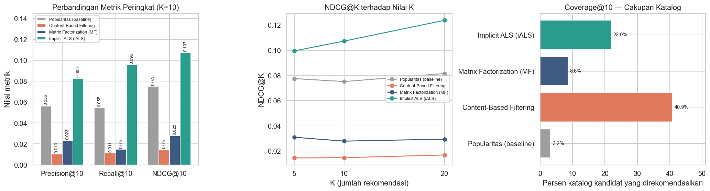

# Sistem Rekomendasi Film — MovieLens

Perbandingan **Content-Based Filtering** dan **Collaborative Filtering** pada 100.836 rating MovieLens, lengkap dengan protokol evaluasi temporal dan baseline popularitas sebagai pembanding.

> Proyek Akhir kelas **Machine Learning Terapan** — Dicoding Indonesia.
> Status: **diterima dengan penilaian bintang 5** (seluruh kriteria utama dan keenam kriteria tambahan terpenuhi).

---

## Ringkasan Proyek

Katalog film berisi ribuan judul, tetapi layar rekomendasi hanya memuat sekitar sepuluh slot. Data pada proyek ini memperlihatkan persoalannya dengan gamblang: **659 film (6,8% katalog) menyerap separuh seluruh rating**, sementara **62,5% film menerima kurang dari lima rating**. Tanpa sistem rekomendasi, ribuan judul praktis tidak akan pernah ditemukan siapa pun.

Empat sistem dibangun dan diadu dengan protokol evaluasi yang identik:

| Kode | Model | Pendekatan | Sinyal yang dipakai |
|---|---|---|---|
| **POP** | Popularitas | Baseline non-personal | Jumlah rating pada data latih |
| **CBF** | Content-Based Filtering | TF-IDF + cosine similarity | Genre dan tag film |
| **MF** | Matrix Factorization (SGD) | Collaborative filtering eksplisit | Nilai rating 0,5–5,0 |
| **iALS** | Implicit ALS | Collaborative filtering implisit | Interaksi "disukai" (rating ≥ 4) |

Kedua algoritma *collaborative filtering* **diimplementasikan langsung dengan NumPy** — tanpa `surprise`, `implicit`, atau pustaka rekomendasi siap pakai — sehingga setiap komponen matematis pada laporan benar-benar tercermin di kode.

---

## Hasil

| Model | Precision@10 | Recall@10 | NDCG@10 | Coverage@10 | RMSE |
|---|---|---|---|---|---|
| Popularitas (baseline) | 0,0563 | 0,0548 | 0,0751 | 3,2% | – |
| Content-Based Filtering | 0,0104 | 0,0112 | 0,0147 | **40,9%** | – |
| Matrix Factorization | 0,0232 | 0,0148 | 0,0278 | 8,6% | **0,8796** |
| **Implicit ALS** | **0,0828** | **0,0957** | **0,1073** | 22,0% | – |

**iALS unggul +47,0% Precision@10, +74,7% Recall@10, dan +42,8% NDCG@10** atas baseline popularitas — dengan cakupan katalog tujuh kali lebih luas, jadi keunggulannya bukan hasil mendaur ulang film terkenal.



---

## Tiga Temuan Utama

### 1. Model dengan RMSE terbaik justru bukan model dengan rekomendasi terbaik

MF memenangi RMSE (0,8796) tetapi NDCG@10-nya hanya 0,0278 — **bahkan kalah dari baseline popularitas**. Sementara iALS, yang tidak dapat memprediksi rating sama sekali, mencapai 0,1073.

Akar penyebabnya dapat ditelusuri konkret: RMSE hanya dihitung pada rating yang **teramati**, sehingga tidak pernah menghukum model karena menempatkan film asing di puncak daftar. Regularisasi ringan (λ = 0,05) yang optimal bagi RMSE justru membiarkan film berdata sedikit memperoleh bias tinggi — lima film dengan bias tertinggi seluruhnya klasik lawas dengan 8–39 rating saja. Film-film itulah yang kemudian membanjiri top-10.

Ini reproduksi langsung temuan Cremonesi, Koren & Turrin (2010).

### 2. Content-based filtering terkunci pada resolusi metadata

Hanya tersedia 19 kategori genre untuk 9.742 film, sehingga ratusan film berbagi kombinasi genre yang persis sama. Pada *The Godfather*, tiga film teratas memperoleh kemiripan **1,000** — sistem tidak punya cara membedakan mana yang lebih layak. Ablasi tiga varian representasi (genre saja, genre+tag, profil deviasi) menunjukkan selisih yang tidak berarti: kendalanya bukan pada cara menyusun profil pengguna, melainkan pada metadata yang tersedia.

Namun CBF unggul telak pada **cakupan katalog (40,9%)** dan kebal terhadap *cold-start item* — 8,4% rating uji menyangkut film yang tak dikenal *collaborative filtering* sama sekali.

### 3. iALS tetap kuat pada pengguna berriwayat pendek

| Segmen | Jumlah pengguna | POP | CBF | MF | iALS |
|---|---|---|---|---|---|
| Riwayat pendek (≤ 37 film) | 198 | 0,0609 | 0,0154 | 0,0082 | **0,1042** |
| Riwayat sedang (38–103 film) | 192 | 0,0609 | 0,0088 | 0,0233 | **0,0902** |
| Riwayat panjang (> 103 film) | 196 | 0,1034 | 0,0199 | 0,0521 | **0,1271** |

*(nilai = NDCG@10)*

Dugaan umum bahwa *collaborative filtering* melemah pada pengguna baru ternyata hanya berlaku untuk MF. Bagi iALS, **20–37 film sudah cukup** untuk menangkap selera seseorang.

---

## Metodologi yang Menjaga Hasil Tetap Jujur

- **Pembagian temporal per pengguna**, bukan acak. Model dilatih pada riwayat awal setiap pengguna dan diuji pada tontonan berikutnya — meniru kondisi produksi. Verifikasi: 0 pengguna melanggar urutan waktu.
- **Data validasi terpisah.** Seluruh penyetelan *hyperparameter* memakai `validasi`; data uji baru disentuh sekali di akhir.
- **Baseline popularitas wajib.** Tanpa pembanding ini, mustahil membuktikan model benar-benar mempelajari selera dan bukan sekadar mengikuti arus.
- **Protokol identik bagi semua model.** *Candidate pool* yang sama (3.039 film), film yang sudah ditonton disingkirkan, definisi relevansi yang sama.
- **Kestabilan diuji** pada K = 5, 10, 20 dan tiga segmen pengguna. Urutan iALS > POP > MF > CBF konsisten di semua kondisi.

---

## Struktur Repositori

```
├── Proyek_Akhir_Sistem_Rekomendasi.ipynb   # Notebook lengkap (sudah dijalankan)
├── Proyek_Akhir_Sistem_Rekomendasi.py      # Ekspor skrip, dapat dijalankan berdiri sendiri
├── Laporan_Proyek_Sistem_Rekomendasi.md    # Laporan lengkap (~900 baris)
├── images/                                 # 8 visualisasi yang dirujuk laporan
├── parts/                                  # Sumber sel notebook (dirakit build_notebook.py)
├── report_parts/                           # Sumber laporan
└── build_notebook.py                       # Merakit parts/ menjadi .ipynb lalu menjalankannya
```

📄 **[Baca laporan lengkapnya di sini](Laporan_Proyek_Sistem_Rekomendasi.md)** — mencakup latar belakang, EDA, delapan tahap persiapan data beserta alasannya, penurunan formula tiap model, dan pembahasan metrik evaluasi.

---

## Cara Menjalankan

```bash
pip install numpy pandas scipy scikit-learn matplotlib seaborn
python Proyek_Akhir_Sistem_Rekomendasi.py
```

Dataset diunduh otomatis dari GroupLens sehingga tidak perlu persiapan manual. Seluruh sumber keacakan dikunci pada `SEED = 42`, jadi angka pada laporan dapat direproduksi persis. Waktu eksekusi penuh sekitar **3 menit** pada CPU biasa — tanpa GPU.

Untuk merakit ulang notebook dari sumbernya:

```bash
python build_notebook.py
```

---

## Dataset

**MovieLens *ml-latest-small*** — [GroupLens Research](https://grouplens.org/datasets/movielens/latest/), University of Minnesota.

| Aspek | Nilai |
|---|---|
| Jumlah rating | 100.836 |
| Jumlah pengguna | 610 |
| Jumlah film | 9.742 |
| Rentang waktu | Maret 1996 – September 2018 |
| Kerenggangan (*sparsity*) | 98,30% |

Berkas dataset **tidak disertakan** dalam repositori ini sesuai ketentuan lisensi GroupLens yang melarang redistribusi. Notebook mengunduhnya sendiri dari tautan resmi.

---

## Referensi

1. Cremonesi, P., Koren, Y., & Turrin, R. (2010). Performance of Recommender Algorithms on Top-N Recommendation Tasks. *RecSys '10*. [DOI](https://doi.org/10.1145/1864708.1864721)
2. Gomez-Uribe, C. A., & Hunt, N. (2015). The Netflix Recommender System. *ACM TMIS*, 6(4). [DOI](https://doi.org/10.1145/2843948)
3. Harper, F. M., & Konstan, J. A. (2015). The MovieLens Datasets: History and Context. *ACM TiiS*, 5(4). [DOI](https://doi.org/10.1145/2827872)
4. Hu, Y., Koren, Y., & Volinsky, C. (2008). Collaborative Filtering for Implicit Feedback Datasets. *ICDM '08*. [DOI](https://doi.org/10.1109/ICDM.2008.22)
5. Järvelin, K., & Kekäläinen, J. (2002). Cumulated Gain-based Evaluation of IR Techniques. *ACM TOIS*, 20(4). [DOI](https://doi.org/10.1145/582415.582418)
6. Koren, Y., Bell, R., & Volinsky, C. (2009). Matrix Factorization Techniques for Recommender Systems. *Computer*, 42(8). [DOI](https://doi.org/10.1109/MC.2009.263)
7. Lops, P., de Gemmis, M., & Semeraro, G. (2011). Content-based Recommender Systems: State of the Art and Trends. *Recommender Systems Handbook*. [DOI](https://doi.org/10.1007/978-0-387-85820-3_3)

---

## Penulis

**Andi Arif Abdillah** — Proyek Akhir Machine Learning Terapan, Dicoding Indonesia.
